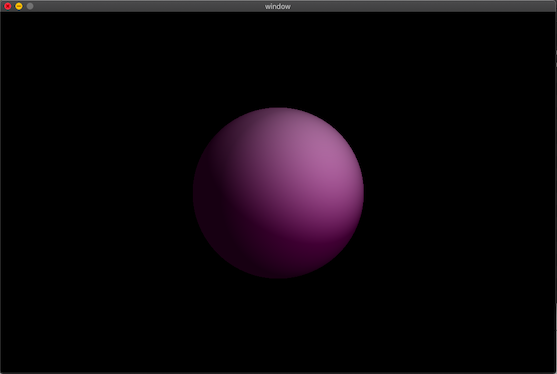
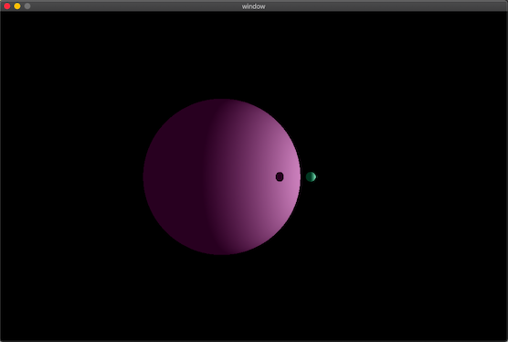
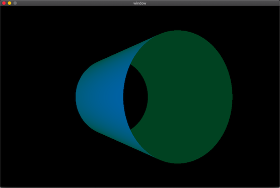
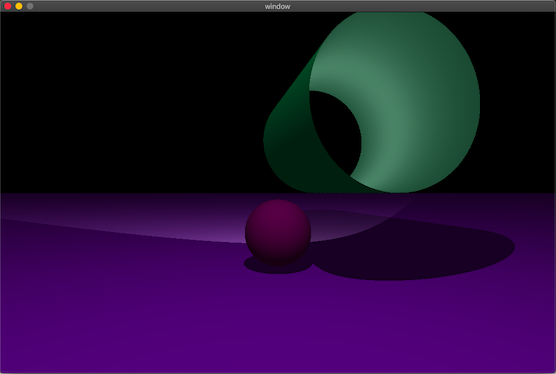

# MiniRT

A ray-tracer, written in c.

This program uses the ray-tracing protocol to generate images. The images represent scenes which are defined by simple geometric objects, a lighting system and one or more cameras with specified angle and position.

## Details

The ray-tracing algorithm is implemented in C and (due to the constraints of the project) the only external functions used are those in the ```math.h``` and ```miniLibX``` libraries, along with a handful of other basics (such as ```malloc``` and ```free```).

The pixel rendering, window management and event handling aspects are dealt with using functions from ```miniLibX```, a simple X-Window (X11R6) programming API in C, designed for students and written by Oliver Crouzet. This in turn makes use of the AppKit and OpenGL frameworks.

## Compilation

A Makefile is included, and to compile simply use ```make```.

Compilation details:

* macOS (linking with the AppKit and OpenGL frameworks): ```gcc <.c files> -lmlx -framework OpenGL -framework AppKit```

* BSD/Linux: ```gcc <.c files> -lmlx -lXext -lX11```

## Usage

The program takes as it's first argument a scene description file with the ```.rt``` extension which specifies the image details. For example:

```./miniRT scene.rt```

This will open a window showing the generated scene. Close the window by pressing ```esc``` or the red cross in the corner.
Including mulitple cameras will generate multiple scene images. These can be tabbed through using the arrow keys.

The ```.rt``` file contains information for the scene's resolution, lighting, camera(s) and object(s):

* image resolution, ```R```, mandatory (horizontal size, vertical size)
* ambient lighting, ```A```, mandatory (brightness, colour)
* spot light, ```l``` (position, brightness, colour)
* camera, ```c``` (position, orientation, horizontal field of view)
* sphere, ```sp``` (position, diameter, colour)
* plane, ```pl``` (position, orientation, colour)
* square, ```sq``` (position, orientation, side size, colour)
* triangle, ```tr``` (vertex positions, colour)
* cylinder, ```cy``` (position, orientation, diameter, height, colour)

Units:

* size: pixels
* brightness: lighting ratio (0 - 1)
* orientation: normalised orientation vector, (-1 - 1 for each axis)
* position: Cartesian coordinates
* colour: RGB values (0 - 255)
* field of view: degrees (0 - 180)

Here is an example of such an ```.rt``` file:

```
R 1920 1080
A 0.2 255,255,255
c -50,0,20 0,0,0 70
l -40,0,30 0.7 255,255,255
l 40,0,10 0.7 255,255,255
pl 0,0,0 0,1.0,0 255,0,225
sp 0,0,20 20 255,0,0
sq 0,100,40 0,0,1.0 30 42,42,0
cy 50.0,0.0,20.6 0,0,1.0 14.2 21.42 10,0,255
tr 10,20,10 10,10,20 20,10,10 0,0,255
```

The program also includes a bitmap file generator function, and it is possible to save the generated image(s) in bmp format by using ```--save``` as the second argument, for example:

```./miniRT scene.rt --save```

## Some examples of generated scenes


A simple sphere illuminated by two spot lights:




The same sphere, this time with another nearby, and a single spot:




A cylinder, viewed from one end:




A horizontal plane, a sphere and a cylinder. Two spots, one above and one inside the cylinder:




## Licenses

MinilibX is licensed under the BSD license: Copyright Olivier Crouzet - 1999-2015.

## Resources

* [*Computer Graphics From Scratch* by Gabriel Gambetta](https://www.gabrielgambetta.com/computer-graphics-from-scratch/introduction.html)
* [Scratchpixel 2.0](https://www.scratchapixel.com/lessons/3d-basic-rendering/introduction-to-ray-tracing)
* [Keuhdall images-example](https://github.com/keuhdall/images_example)
* [Equation for points inside a triangle](https://blackpawn.com/texts/pointinpoly/)
* [Equation for cylinder line intersection](https://en.wikipedia.org/wiki/User:Nominal_animal)
* [Rotation in 3D space](http://paulbourke.net/geometry/rotate/)
* [Bitmap generation](https://itnext.io/bits-to-bitmaps-a-simple-walkthrough-of-bmp-image-format-765dc6857393)
