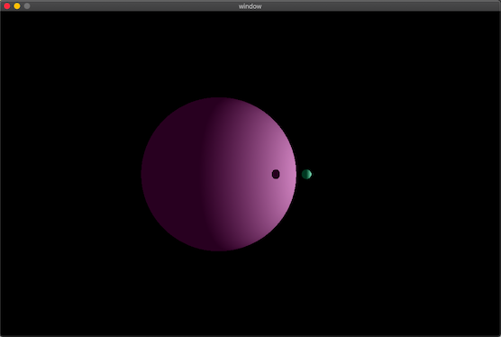

# MiniRT

A ray-tracer, written in c.

This program uses the ray-tracing protocol to generate images. The images represent scenes which are defined by simple geometric objects, a lighting system and one or more cameras with specified angle and position.

## Details

The ray-tracing algorithm is implemented in c and (due to the rules of the project) the only external functions used are those in the math.h library, along with and a handful of other basics (such as malloc and free).

The pixel rendering, window management and event handling aspects are dealt with using functions from the miniLibX, a simple X-Window (X11R6) programming API in C, designed for students and written by Oliver Crouzet. This in turn makes use of the AppKit and OpenGL frameworks.

The program takes as it's first argument a scene description file with the ```.rt``` extension which specifies the image details. It contains information for the:

* image resolution
* ambient lighting (brightness and colour)
* spot lighting (position, brightness and colour of spots)
* cameras (position, angle and field of view)
* objects (position, dimension, colour and orientation where applicable)

The objects that can be generated are:

* sphere
* plane
* square
* triangle
* cylinder

Here is an example of such an ```.rt``` file:

```
R 1920 1080
A 0.2 255,255,255
c -50,0,20 0,0,0 70
l -40,0,30 0.7 255,255,255
pl 0,0,0 0,1.0,0 255,0,225
sp 0,0,20 20 255,0,0
sq 0,100,40 0,0,1.0 30 42,42,0
cy 50.0,0.0,20.6 0,0,1.0 14.2 21.42 10,0,255
tr 10,20,10 10,10,20 20,10,10 0,0,255
```

## Some examples of generated scenes


A simple sphere illuminated by two spot lights:


The same sphere, this time with another nearby, and a single spot:




A cylinder, viewed from one end:


A horizontal plane, a sphere and a cylinder. Two spots, one above and one inside the cylinder:


## License

MinilibX is licensed under the BSD license: Copyright Olivier Crouzet - 1999-2015.
